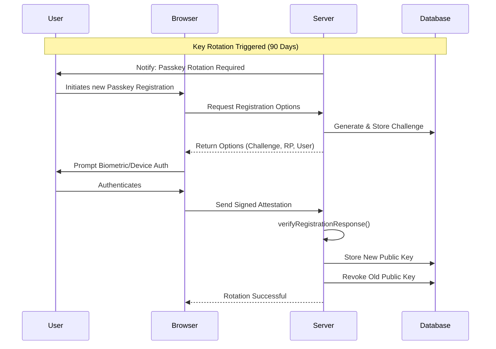

# WebAuthn Key Rotation & Device Management Manual

This document outlines the standard operating procedures for managing WebAuthn/FIDO2 credentials, configuring the SimpleWebAuthn server, executing key rotations, and performing security audits.

## 1. FIDO2 Packed Attestation & Verification

The server utilizes FIDO2 packed attestation during passkey registration. This ensures that the generated credentials originate from a legitimate authenticator.

### Server Verification Route Code

Our implementation relies on `@simplewebauthn/server` for validating the registration response. The verification logic extracts the client data, verifies the expected origin, and stores the `credentialId` and `publicKey` securely.

Here is the core logic from our registration verify route (`src/app/api/auth/passkey/register/verify/route.ts`):

```typescript
import { NextResponse } from "next/server";
import { auth } from "@clerk/nextjs/server";
import { verifyRegistrationResponse } from "@simplewebauthn/server";
import { prisma } from "@/lib/prisma";
import { parseClientDataJSON } from "@/lib/webauthn";
import { getRpId, getExpectedOrigin } from "@/lib/passkey";
import type { RegistrationResponseJSON } from "@simplewebauthn/browser";

export async function POST(req: Request) {
  try {
    const { userId } = await auth();
    if (!userId) {
      return NextResponse.json({ error: "Unauthorized" }, { status: 401 });
    }

    const body = await req.json();
    const { registrationResponse, name } = body;

    const challengeRecord = await prisma.passkeyChallenge.findFirst({
      where: { userId, expiresAt: { gt: new Date() } },
      orderBy: { createdAt: "desc" },
    });

    if (!challengeRecord) {
      return NextResponse.json({ error: "Passkey challenge expired" }, { status: 400 });
    }

    const clientData = registrationResponse.response?.clientDataJSON
      ? parseClientDataJSON(registrationResponse.response.clientDataJSON)
      : null;

    // DEV NOTE: Some cross-platform authenticators (e.g., older iOS versions) might omit or alter
    // certain extensions. Ensure `getExpectedOrigin` robustly handles trailing slashes or port
    // variations if testing across local network proxies.
    const verification = await verifyRegistrationResponse({
      response: registrationResponse,
      expectedChallenge: challengeRecord.challenge,
      expectedOrigin: getExpectedOrigin(req, clientData?.origin),
      expectedRPID: getRpId(req),
    });

    if (!verification.verified || !verification.registrationInfo) {
      return NextResponse.json({ error: "Passkey verification failed" }, { status: 400 });
    }

    const { credential, credentialDeviceType, credentialBackedUp, aaguid } = verification.registrationInfo;

    // Save newly verified credential
    await prisma.passkeyCredential.create({
      data: {
        userId,
        credentialId: credential.id,
        publicKey: Buffer.from(credential.publicKey),
        counter: BigInt(credential.counter),
        transports: credential.transports || [],
        deviceType: credentialDeviceType,
        backedUp: credentialBackedUp,
        name: name?.trim() || "Passkey Credential",
        aaguid: aaguid || null,
        expiresAt: new Date(Date.now() + 90 * 24 * 60 * 60 * 1000), // 90 days rotation policy
      },
    });

    return NextResponse.json({ verified: true });
  } catch (error) {
    return NextResponse.json({ error: "Failed to verify passkey" }, { status: 500 });
  }
}
```

## 2. SimpleWebAuthn Server Configuration

Our server configuration is built around robust Relying Party (RP) settings to prevent replay attacks and ensure origin integrity.

- **RP ID (`rpID`)**: Bound strictly to the deployment domain. Subdomains must be handled carefully.
- **Expected Origin**: Determined dynamically depending on the environment (e.g., `localhost` in dev, `https://staging.worksphere.app` in prod/staging).
- **Challenge Lifespan**: Challenges expire after 5 minutes and are single-use. The database record is immediately deleted upon a successful verification or after the time window closes.

## 3. Key Rotation Policies

Key rotation is critical for mitigating the risk of compromised authenticators or outdated cryptographic algorithms.

### Policy Guidelines
- **Automatic Expiry**: Credentials are set to expire 90 days after registration. *Note on Trade-off:* While passkeys are inherently designed to last indefinitely unless compromised, this 90-day rotation is enforced to comply with strict internal security mandates. It acts as a soft reminder to ensure active device management rather than a hard lockout.
- **Grace Period**: Users are notified 14 days before their primary credential expires to register a new device.
- **Revocation**: If a user reports a lost device, the admin team must immediately revoke the credential ID manually or via the user dashboard.

### Key Rotation Sequence



## 4. User Device Management

Handling lost or upgraded devices ensures continued access without compromising security. 

- **Device Provisioning**: Users can register multiple passkeys across different devices (e.g., phone, laptop, security key).
- **Fallback Methods**: Always require a verified email or recovery code for adding new devices if the primary passkey is unavailable.
- **AAGUID Tracking**: We track the AAGUID (Authenticator Attestation GUID) to monitor the types of devices users are registering and flag vulnerable hardware.

## 5. Security Audit Checklist

Run through this checklist quarterly or after major library updates.

- [ ] **Challenge Integrity**: Ensure challenges are at least 32 bytes and generated securely (e.g., using `crypto.randomBytes`).
- [ ] **Challenge Replay Check**: Verify that a challenge is marked as "spent" and deleted from the database immediately upon the first verification attempt.
- [ ] **Origin Validation**: Confirm that `expectedOrigin` strictly matches the frontend URL to prevent phishing.
- [ ] **RP ID Validation**: Check that `expectedRPID` aligns with the domain where the credentials were created.
- [ ] **Reverse Proxy Headers**: Ensure origin logic properly handles multi-tenant setups or edge networks (e.g., Vercel, Cloudflare) when intercepting headers like `x-forwarded-host` or `x-forwarded-proto`.
- [ ] **Counter Checks**: Ensure the server enforces the `signCount` to detect cloned authenticators (if supported by the device).
- [ ] **Dependency Updates**: Check for CVEs in `@simplewebauthn/server` and `@simplewebauthn/browser`.
- [ ] **Attestation Formats**: Review accepted attestation formats (`packed`, `none`, `android-key`, etc.) and ensure unknown formats are rejected.

---
*Maintained by the Security and Infrastructure Team.*
